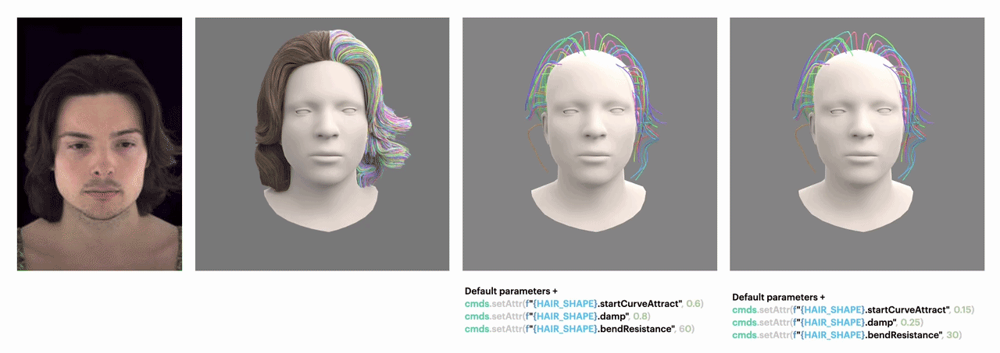

# Hair Simulation using Maya



In **PhysHead**, we use Maya to simulate hair strands.

> See [Environment setup](#0-environment-setup) before running scripts. In fact, any simple environment with PyTorch3D would work.

<details>
<summary><b>0. Environment setup</b> (click to expand)</summary>

Create `physheadsim` and activate it:

```bash
conda env create -f environment.yml
conda activate physheadsim
```

### PyTorch + PyTorch3D

```bash
pip install torch==2.5.1+cu121 --index-url https://download.pytorch.org/whl/cu121
pip install "git+https://github.com/facebookresearch/pytorch3d.git@V0.7.8"
```

See the [PyTorch3D install guide](https://github.com/facebookresearch/pytorch3d/blob/main/INSTALL.md) if you need a different CUDA/torch build.

### Blender

Set your `BLENDER_PATH` inside `run_head.sh`.

</details>

## 1. Download sample data

Download the sample dataset from [Google Drive](https://drive.google.com/file/d/1SsM5iodhJeZxGA-gghDr1GwaccQegVmb/view?usp=sharing) and place it so the final path to sample data looks like:

```
data/
└── input/
    └── rightleft/
        └── 20230313--1653--RHL466/
```

## 2. Prepare meshes for simulation

We need a folder of meshes (an animation sequence) on which we want to simulate the hair — see `data/input/rightleft/20230313--1653--RHL466/flame_ply/` for an example. Rename the meshes in the folder to `00000.ply`, `00001.ply`, etc. (zero-padded frame numbers) if they are not already in that format.

This step converts the per-frame FLAME meshes (`flame_ply/*.ply`) into a Maya-ready Alembic cache.

Before running, edit the `SUBJECT`, `EXPRESSION`, `FPS`, and `BLENDER_PATH` variables at the top of `run_head.sh`.

```bash
bash run_head.sh
```

Outputs land in `data/output/${EXPRESSION}/${SUBJECT}/`.

## 3. Prepare sparse hair for simulation

This step samples sparse strands from the dense hair and redistributes points evenly along each strand.

Before running, edit `SUBJECT`, `EXPRESSION`, `K` (number of sampled strands), `P` (points per strand), and `N_STRAND` / `N_SEGMENTS` (strand and point counts of the *original* dense hairstyle) at the top of `run_hair.sh`.

```bash
bash run_hair.sh
```

The following files are ready for simulation:

- `00000.abc` (from step 2)
- `guided_2_k200_p20_dist.pickle` (from this step)

## 4. Run the Maya pipeline

Edit the paths inside `maya_scripts/run_pipeline.py`, then run it to simulate:

```bash
maya_scripts/run_pipeline.py
```

## 5. Densify hair after simulation

This step uses strand skinning to produce the dense hair (simulated):

```bash
bash run_after_sim.sh
```

## 6. Render simulated hair (optional)

I fully* vibecoded rendering script to see quickly how the simulation looks like.
It render per-frame PNGs of the simulated strands over the head mesh with Blender:

```bash
blender --background --python hair_scripts/render_blender.py -- \
    --input_dir  data/sim_out/${EXPRESSION}/${SUBJECT} \
    --output_dir data/sim_out/${EXPRESSION}/${SUBJECT}/hair_renders
```

To render a single frame of the **dense** hair (from a flat PLY point cloud produced by step 5) over a head mesh:

```bash
blender --background --python hair_scripts/render_dense_single.py -- \
    --head_ply   data/input/rightleft/${SUBJECT}/flame_ply/00000.ply \
    --hair_ply   data/sim_out/${EXPRESSION}/${SUBJECT}/nh_strands_k60000_p50_dist.ply \
    --n_strands  60000 \
    --n_points   50 \
    --output_dir data/sim_out/${EXPRESSION}/${SUBJECT}/dense_render
```

Add `--rainbow` to give each strand a distinct color for debugging.

